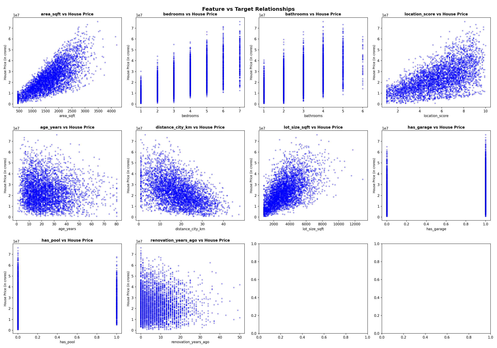
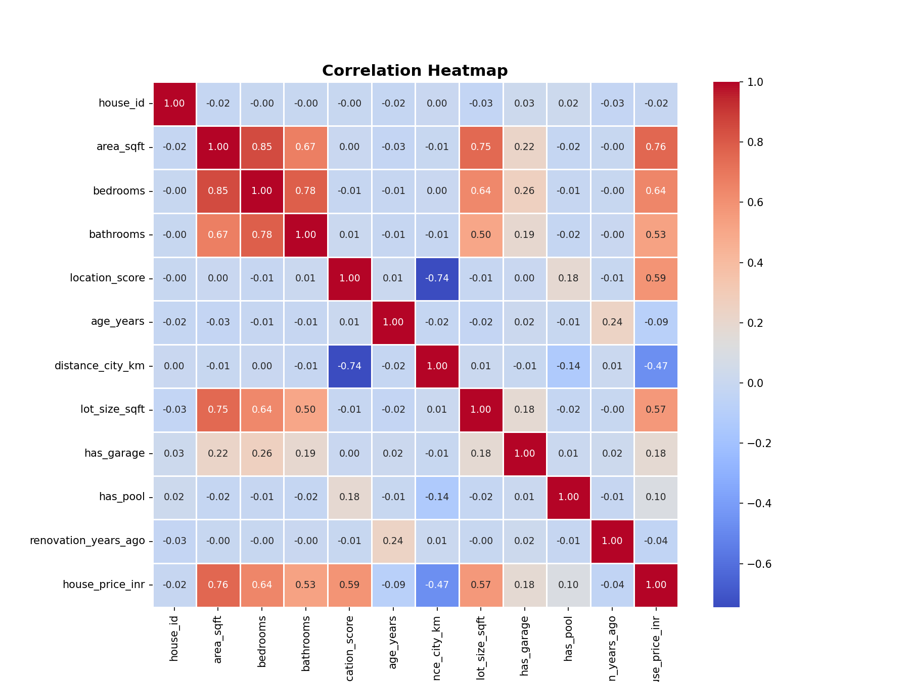
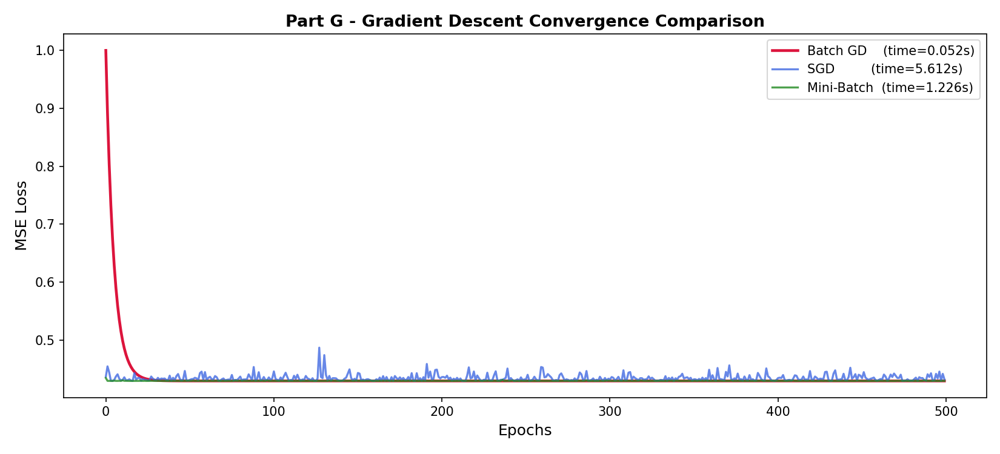

<div align="center">

# 🏠 Predictive Insight Engine

**A comprehensive end-to-end machine learning pipeline for predicting Indian real estate prices using regression techniques, feature engineering, and gradient descent optimization.**

[](#)
[](#)
[](#)
[](#)
[](#)

</div>

<br>

## 🌟 About the Project

This project builds a **Predictive Insight Engine** that forecasts house prices (in INR) using a dataset of ~4,200 Indian residential property records. Starting from raw data exploration through to gradient descent optimization, the notebook walks through every stage of a production-grade supervised learning workflow — from foundational theory to hands-on model comparison.

The project tackles real-world ML challenges: selecting the right regression model, diagnosing overfitting vs. underfitting, evaluating multiple performance metrics, and understanding the trade-offs between different optimization strategies.

### 🎯 Key Objectives

* **Supervised Learning Fundamentals:** Understanding regression vs. classification, the bias-variance trade-off, and the assumptions of linear models.
* **Exploratory Data Analysis:** Visualizing feature-target relationships and computing a full correlation matrix to identify multicollinearity and key predictors.
* **Multi-Model Regression:** Progressing from Simple Linear Regression → Multiple Linear Regression → Polynomial Regression with rigorous comparison.
* **Model Evaluation:** Implementing MSE, MAE, RMSE, R², and Adjusted R² to comprehensively assess model performance.
* **Gradient Descent Optimization:** Implementing and benchmarking Batch GD, Stochastic GD (SGD), and Mini-Batch GD from scratch.

---

## 🛠️ Technologies & Tools

* **Programming Language:** Python 3.x
* **Data Manipulation & Analysis:** Pandas, NumPy
* **Machine Learning & Preprocessing:** Scikit-Learn (LinearRegression, PolynomialFeatures, StandardScaler, train_test_split)
* **Data Visualization:** Matplotlib, Seaborn
* **Environment:** Jupyter Notebook
* **Version Control:** Git & GitHub

---

## 📂 Repository Architecture

```text
📦 Predictive-Insight-Engine
 ┣ 📜 predictive_insight_engine.ipynb       # Core notebook with full ML pipeline
 ┣ 📜 HousePrice.csv                        # [INPUT] Raw dataset — 4,199 records × 12 features
 ┣ 📜 Correlation_Matrix.png                # [OUTPUT] Heatmap of feature correlations
 ┣ 📜 Feature_vs_Target_Relationships.png   # [OUTPUT] Scatter plots of each feature vs house price
 ┗ 📜 Gadient_Descent.png                  # [OUTPUT] Convergence comparison of all three GD variants
```

---

## 📊 Dataset Overview

The `HousePrice.csv` dataset contains **4,199 residential property records** across **12 columns**, with `house_price_inr` as the target variable.

| Feature | Type | Description |
|---|---|---|
| `house_id` | int | Unique identifier |
| `area_sqft` | int | Total built-up area in sq. ft. |
| `bedrooms` | int | Number of bedrooms |
| `bathrooms` | int | Number of bathrooms |
| `location_score` | float | Desirability score (1–10) |
| `age_years` | int | Age of the property in years |
| `distance_city_km` | float | Distance from the city center (km) |
| `lot_size_sqft` | int | Total plot area in sq. ft. |
| `has_garage` | int | Binary flag (1 = Yes, 0 = No) |
| `has_pool` | int | Binary flag (1 = Yes, 0 = No) |
| `renovation_years_ago` | int | Years since last renovation |
| `house_price_inr` | int | **Target** — Sale price in INR |

---

## 🔍 The ML Pipeline

The `predictive_insight_engine.ipynb` notebook is structured across **7 logical parts**:

### Part A — Theory & Foundations
Covers core ML concepts answered as structured Q&A: supervised learning, regression vs. classification, simple linear regression, the 5 assumptions of OLS, the bias-variance trade-off, and examples of overfitting/underfitting.

### Part B — Dataset Understanding & Preparation
Loads `HousePrice.csv`, inspects shape, data types, summary statistics, and missing values. Defines the 10 input features and the target variable, then produces two key visualizations:

**Feature vs Target Relationships** — scatter plots of all 10 features against `house_price_inr` to visually identify linearity and outliers.



**Correlation Heatmap** — a full 12×12 heatmap revealing that `area_sqft` (0.76), `bedrooms` (0.64), `location_score` (0.59), and `lot_size_sqft` (0.57) are the strongest predictors of price, while `distance_city_km` has a notable negative correlation (-0.47).



### Part C — Simple Linear Regression
Fits a univariate model using only `area_sqft` as the predictor. Plots the regression line over test data and analyzes residuals via a scatter plot and histogram to diagnose model fit.

### Part D — Model Evaluation Metrics
Implements a reusable `evaluate_model()` function that computes and interprets:
* **MSE** — penalizes large errors heavily
* **MAE** — average absolute error; robust to outliers
* **RMSE** — error in the same unit as the target (INR)
* **R²** — percentage of variance explained
* **Adjusted R²** — R² penalized for the number of predictors

### Part E — Multiple Linear Regression
Trains a full MLR model on all 10 features. Prints sorted coefficients to interpret the marginal impact of each feature and evaluates using the same metric suite for direct comparison with the SLR baseline.

### Part F — Polynomial Regression
Iterates over polynomial degrees 1 through 4 on `area_sqft` to demonstrate the bias-variance trade-off — showing how model complexity affects train/test performance and where overfitting begins.

### Part G — Gradient Descent Optimization
Implements all three gradient descent variants **from scratch** using NumPy on `StandardScaler`-normalized data and benchmarks them over 500 epochs:

| Variant | Convergence Speed | Stability | Time (approx.) |
|---|---|---|---|
| **Batch GD** | Fast (smooth) | Very stable | ~0.05s |
| **Mini-Batch GD** | Fast (smooth) | Stable | ~1.2s |
| **SGD** | Fast initially, noisy | High variance | ~5.6s |



Batch GD converges fastest and most smoothly. SGD reaches a similar loss floor but with persistent noise due to single-sample updates. Mini-Batch GD offers a practical middle ground between the two.

---

## ⚙️ Getting Started & Installation

### 1. Clone the Repository

```bash
git clone https://github.com/<your-username>/Predictive-Insight-Engine.git
cd Predictive-Insight-Engine
```

### 2. Set Up a Virtual Environment (Recommended)

```bash
# Create virtual environment
python -m venv venv

# Activate it
# On Windows:
venv\Scripts\activate
# On macOS/Linux:
source venv/bin/activate
```

### 3. Install Dependencies

```bash
pip install pandas numpy matplotlib seaborn scikit-learn jupyter
```

### 4. Launch the Notebook

```bash
jupyter notebook
```

Open `predictive_insight_engine.ipynb` and run cells sequentially from top to bottom.

---

## 📈 Key Findings

* `area_sqft` alone explains ~57% of price variance (R² ≈ 0.57 in SLR).
* Adding all 10 features in MLR pushes R² significantly higher, confirming multivariate relationships.
* Polynomial degrees beyond 2 begin to overfit — Adjusted R² starts declining even as raw R² improves.
* Batch Gradient Descent is the most computationally efficient variant for this dataset size; SGD is noisiest but theoretically preferred for very large datasets.
* `distance_city_km` has a strong negative impact on price (-0.47 correlation), while `location_score` has a meaningful positive effect (0.59).

---


## 👨‍💻 Author

**Krish Desai**

* GitHub: [@krish-desai-123](https://github.com/krish-desai-123)

---

<div align="center">
<i>If this project helped you understand regression and gradient descent better, consider dropping a ⭐!</i>
</div>